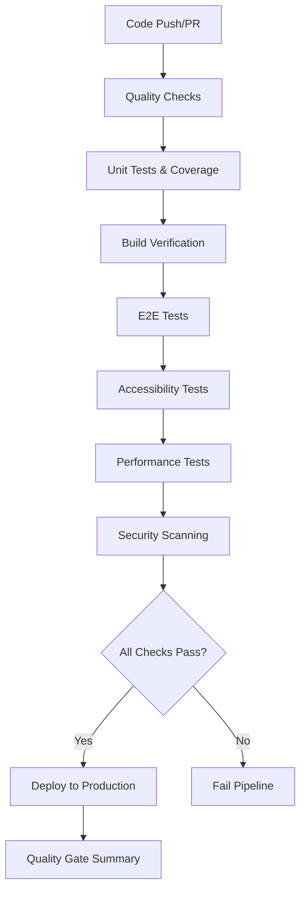

# CI/CD Configuration for Properties 4 Creations

This document provides a comprehensive overview of the CI/CD setup for the Properties 4 Creations website.

## Overview

The CI/CD pipeline is designed to ensure code quality, accessibility, performance, and security through automated testing and deployment processes.

## Architecture

### Pipeline Flow



### Quality Gates

1. **Code Quality**: Linting, TypeScript checks, security audit
2. **Test Coverage**: Minimum 70% coverage across all metrics
3. **Build Verification**: Successful build and artifact generation
4. **E2E Testing**: Cross-browser compatibility and functionality
5. **Accessibility**: WCAG 2.1 AA compliance with axe-core
6. **Performance**: Lighthouse scores and custom metrics
7. **Security**: Vulnerability scanning and dependency checks

## File Structure

```
.github/
├── workflows/
│   ├── ci.yml          # Main CI/CD pipeline
│   └── deploy.yml      # Manual deployment workflow
└── README.md           # CI/CD documentation

tests/
├── setup.js            # Jest configuration
├── __mocks__/
│   └── fileMock.js     # Asset mocking
├── unit/
│   └── example.test.js # Unit test examples
└── e2e/
    ├── accessibility.spec.js  # Accessibility tests
    └── performance.spec.js    # Performance tests

.husky/
├── pre-commit          # Pre-commit hook
└── _/
    └── husky.sh        # Husky shell script
```

## Configuration Details

### GitHub Actions Workflows

#### Main CI Pipeline (`.github/workflows/ci.yml`)

**Triggers:**
- Push to `main` or `develop` branches
- Pull requests to `main` branch

**Jobs:**
1. **Quality** - Code linting and security checks
2. **Test** - Unit tests with coverage reporting
3. **Build** - Build verification and artifact creation
4. **E2E** - End-to-end testing across browsers
5. **Accessibility** - axe-core accessibility validation
6. **Performance** - Lighthouse and custom performance tests
7. **Security** - npm audit and Snyk scanning
8. **Deploy** - Production deployment (main branch only)
9. **Quality Gate** - Final validation summary

#### Deployment Workflow (`.github/workflows/deploy.yml`)

**Triggers:**
- Manual dispatch with environment selection
- Optional force deployment bypass

**Features:**
- Environment-specific deployments
- Quality gate bypass option
- Multiple deployment targets (GitHub Pages, Netlify)

### Test Configuration

#### Jest Configuration (`jest.config.js`)

```javascript
{
  testEnvironment: 'jsdom',
  setupFilesAfterEnv: ['<rootDir>/tests/setup.js'],
  testMatch: [
    '<rootDir>/tests/**/*.test.js',
    '<rootDir>/js/**/*.test.js'
  ],
  coverageThreshold: {
    global: {
      branches: 70,
      functions: 70,
      lines: 70,
      statements: 70
    }
  }
}
```

#### Playwright Configuration (`playwright.config.js`)

```javascript
{
  testDir: './tests/e2e',
  timeout: 30 * 1000,
  fullyParallel: true,
  projects: [
    { name: 'chromium', use: { ...devices['Desktop Chrome'] } },
    { name: 'firefox', use: { ...devices['Desktop Firefox'] } },
    { name: 'webkit', use: { ...devices['Desktop Safari'] } },
    { name: 'Mobile Chrome', use: { ...devices['Pixel 5'] } },
    { name: 'Mobile Safari', use: { ...devices['iPhone 12'] } }
  ]
}
```

### Package.json Scripts

Enhanced scripts for comprehensive testing:

```json
{
  "scripts": {
    "test:ci": "npm run test:coverage && npm run test:e2e && npm run test:accessibility && npm run test:performance",
    "quality:check": "npm run lint && npm run test:coverage && npm run test:e2e && npm run test:accessibility",
    "security:audit": "npm audit --audit-level=moderate",
    "build:verify": "npm run build && npm run preview",
    "precommit": "npm run quality:check"
  }
}
```

## Quality Standards

### Code Coverage
- **Minimum**: 70% across all metrics
- **Tools**: Jest with coverage reporting
- **Reporting**: Codecov integration

### Accessibility
- **Standards**: WCAG 2.1 AA compliance
- **Tools**: axe-core with Playwright
- **Checks**: Color contrast, keyboard navigation, ARIA labels

### Performance
- **Load Time**: Under 3 seconds
- **FCP**: Under 1.5 seconds
- **Tools**: Lighthouse and custom metrics
- **Monitoring**: Automated performance budgets

### Security
- **Vulnerabilities**: No high-severity issues
- **Tools**: npm audit, Snyk integration
- **Dependencies**: Regular updates and monitoring

## Deployment Strategy

### Automatic Deployment
- **Trigger**: Push to `main` branch
- **Target**: GitHub Pages
- **Validation**: All quality gates must pass

### Manual Deployment
- **Trigger**: Manual workflow dispatch
- **Targets**: Staging or production
- **Options**: Quality gate bypass available

### Rollback Strategy
- **GitHub Pages**: Automatic version history
- **Netlify**: Manual rollback through dashboard
- **Monitoring**: Post-deployment health checks

## Environment Variables

Required GitHub Secrets:

```yaml
CODECOV_TOKEN: # For code coverage reporting
SNYK_TOKEN: # For security scanning
NETLIFY_AUTH_TOKEN: # For Netlify deployment
NETLIFY_SITE_ID: # For Netlify deployment
```

## Monitoring and Reporting

### Test Results
- **Unit Tests**: Jest with coverage reports
- **E2E Tests**: Playwright with video and screenshot artifacts
- **Accessibility**: axe-core violation reports
- **Performance**: Lighthouse reports and custom metrics

### Notifications
- **GitHub Actions**: Built-in workflow status
- **Codecov**: Coverage reporting and trends
- **Snyk**: Security vulnerability notifications

## Troubleshooting

### Common Issues

1. **Test Failures in CI**
   - Check environment differences
   - Verify dependency installation
   - Review timing issues in E2E tests

2. **Build Failures**
   - Ensure all dependencies are in package.json
   - Check for missing environment variables
   - Verify build configuration

3. **Accessibility Failures**
   - Review axe-core violation details
   - Check for missing alt text and labels
   - Verify color contrast ratios

4. **Performance Issues**
   - Analyze Lighthouse reports
   - Check for large resource files
   - Optimize images and assets

### Debug Commands

```bash
# Run quality checks locally
npm run quality:check

# Run all tests
npm run test:all

# Build and verify
npm run build:verify

# Run specific test suites
npm run test:accessibility
npm run test:performance
```

## Best Practices

### Code Quality
- Follow established coding standards
- Write comprehensive tests
- Use meaningful commit messages
- Review accessibility requirements

### Performance
- Optimize images and assets
- Minimize JavaScript bundle size
- Use efficient CSS selectors
- Implement lazy loading

### Security
- Keep dependencies updated
- Use secure coding practices
- Regular security audits
- Environment variable management

### Accessibility
- Semantic HTML structure
- Proper ARIA attributes
- Keyboard navigation support
- Color contrast compliance

## Future Enhancements

### Planned Improvements
- [ ] Visual regression testing
- [ ] Bundle size monitoring
- [ ] Custom performance metrics
- [ ] Advanced security scanning
- [ ] Multi-environment deployments
- [ ] Automated rollback triggers

### Monitoring Enhancements
- [ ] Real user monitoring (RUM)
- [ ] Error tracking and reporting
- [ ] Performance budget enforcement
- [ ] Accessibility compliance monitoring

## Support

For issues or questions related to the CI/CD pipeline:

1. Check the troubleshooting section above
2. Review GitHub Actions logs and artifacts
3. Consult the individual tool documentation
4. Create an issue in the repository

## Contributing

When contributing to the CI/CD configuration:

1. Test changes in a feature branch
2. Ensure all quality gates pass
3. Update documentation as needed
4. Follow the established patterns and conventions