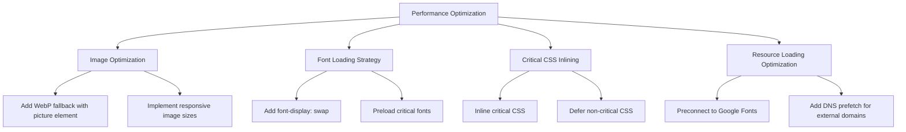
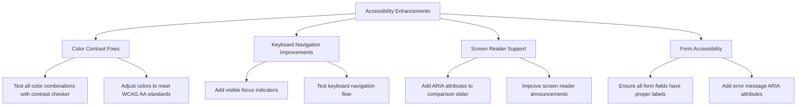
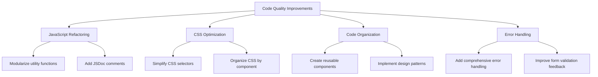
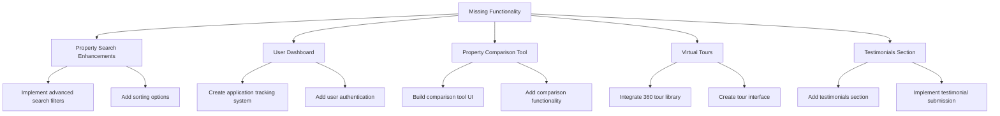
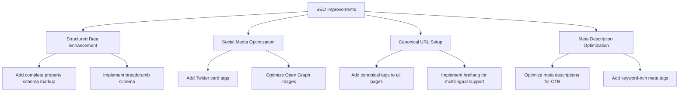
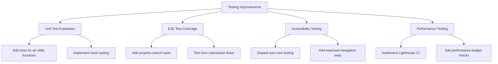
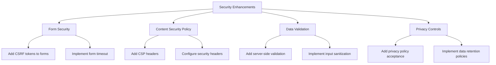
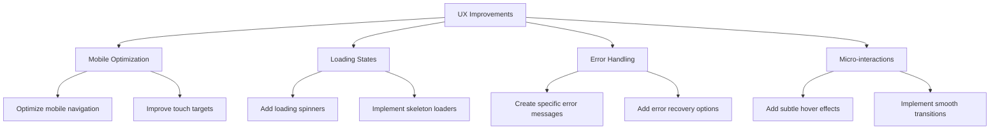

# Properties 4 Creations - Deep Analysis Report

## Executive Summary

This report presents a comprehensive analysis of the Properties 4 Creations website, identifying areas for improvement across multiple dimensions including performance, accessibility, code quality, functionality, and user experience.

## Current State Analysis

### Strengths

1. **Solid Foundation**: Well-structured HTML5, CSS3, and vanilla JavaScript architecture
2. **Design System**: Comprehensive CSS custom properties and component-based design
3. **Accessibility**: Good baseline accessibility features including ARIA attributes and semantic HTML
4. **Testing**: Existing test infrastructure with Jest and Playwright
5. **Performance**: Basic performance optimizations like lazy loading and resource hints

### Key Findings

## 1. Performance Optimization Opportunities

### Critical Issues

- **Image Optimization**: Missing WebP fallback for older browsers
- **Font Loading**: No font-display strategy causing potential FOIT/FOUT issues
- **Critical CSS**: No inline critical CSS for above-the-fold content
- **Resource Loading**: No preconnect for critical third-party resources

### Recommendations

## 2. Accessibility Enhancements

### Critical Issues

- **Color Contrast**: Some color combinations don't meet WCAG AA standards
- **Keyboard Navigation**: Missing focus indicators for interactive elements
- **Screen Reader**: Incomplete ARIA attributes for complex components
- **Form Accessibility**: Missing proper label associations for some form fields

### Recommendations

## 3. Code Quality & Maintainability

### Critical Issues

- **JavaScript Organization**: Some functions could be better organized and modularized
- **CSS Specificity**: Some overly specific selectors that could be simplified
- **Code Duplication**: Repeated patterns that could be abstracted
- **Error Handling**: Incomplete error handling in form submissions

### Recommendations

## 4. Missing Functionality

### Critical Missing Features

- **Property Search**: Advanced search with filters and sorting
- **Application Tracking**: User dashboard for application status
- **Property Comparison**: Side-by-side property comparison tool
- **Virtual Tours**: 360-degree virtual tour integration
- **Testimonials**: Customer testimonials section

### Recommendations

## 5. SEO & Metadata Improvements

### Critical Issues

- **Structured Data**: Incomplete schema.org markup for properties
- **Open Graph**: Missing some social media optimization tags
- **Canonical URLs**: Some pages missing canonical tags
- **Meta Descriptions**: Some pages could have more optimized descriptions

### Recommendations

## 6. Testing & Quality Assurance

### Critical Issues

- **Test Coverage**: Incomplete test coverage for JavaScript functions
- **E2E Testing**: Limited end-to-end test scenarios
- **Accessibility Testing**: Basic accessibility tests need expansion
- **Performance Testing**: No automated performance testing

### Recommendations

## 7. Security Enhancements

### Critical Issues

- **Form Security**: Missing CSRF protection on forms
- **Content Security**: Basic CSP headers needed
- **Data Validation**: Server-side validation needed for forms
- **Privacy**: Enhanced privacy controls for user data

### Recommendations

## 8. User Experience Improvements

### Critical Issues

- **Mobile Experience**: Some mobile UI elements could be optimized
- **Loading States**: Missing loading indicators for async operations
- **Error Messages**: Generic error messages could be more specific
- **Micro-interactions**: Missing subtle animations for better UX

### Recommendations

## Implementation Priority Matrix

| Priority | Area | Impact | Effort |
|----------|------|--------|--------|
| High | Performance Optimization | High | Medium |
| High | Accessibility Enhancements | High | Low |
| High | Security Enhancements | High | Medium |
| Medium | Missing Functionality | Medium | High |
| Medium | Code Quality | Medium | Medium |
| Medium | Testing Improvements | Medium | Medium |
| Medium | SEO Improvements | Medium | Low |
| Low | UX Improvements | Low | Low |

## Detailed Implementation Plan

### Phase 1: Critical Fixes (Week 1-2)

1. **Performance Optimization**
   - Implement image optimization with WebP fallbacks
   - Add font loading strategy with font-display: swap
   - Inline critical CSS for above-the-fold content
   - Add resource loading optimizations

2. **Accessibility Enhancements**
   - Fix color contrast issues
   - Add visible focus indicators
   - Improve ARIA attributes for complex components
   - Ensure all form fields have proper labels

3. **Security Enhancements**
   - Add CSRF protection to forms
   - Implement basic CSP headers
   - Add server-side validation for forms
   - Implement privacy controls

### Phase 2: Core Improvements (Week 3-4)

1. **Code Quality & Organization**
   - Refactor JavaScript into modular components
   - Optimize CSS selectors and organization
   - Add comprehensive JSDoc comments
   - Implement design patterns

2. **Testing Expansion**
   - Add unit tests for all utility functions
   - Expand E2E test coverage
   - Enhance accessibility testing
   - Implement performance testing

3. **SEO Improvements**
   - Add complete structured data markup
   - Optimize social media tags
   - Implement canonical URLs
   - Enhance meta descriptions

### Phase 3: Feature Enhancements (Week 5-6)

1. **Property Search Enhancements**
   - Implement advanced search filters
   - Add sorting options
   - Improve search UI/UX

2. **User Dashboard**
   - Create application tracking system
   - Add user authentication
   - Implement dashboard UI

3. **Property Comparison Tool**
   - Build comparison tool UI
   - Add comparison functionality
   - Implement responsive design

### Phase 4: Polish & Optimization (Week 7-8)

1. **Mobile Experience Optimization**
   - Improve mobile navigation
   - Enhance touch targets
   - Test mobile-specific flows

2. **Loading States & Error Handling**
   - Add loading indicators
   - Implement skeleton loaders
   - Create specific error messages

3. **Micro-interactions & UX Polish**
   - Add subtle animations
   - Implement smooth transitions
   - Enhance hover effects

## Success Metrics

- **Performance**: Achieve 90+ Lighthouse scores across all categories
- **Accessibility**: 100% WCAG 2.1 AA compliance
- **Code Quality**: 80%+ test coverage with meaningful tests
- **SEO**: Improved search rankings and organic traffic
- **User Experience**: Reduced bounce rate and increased engagement
- **Security**: No critical security vulnerabilities

## Risk Assessment

### High Risk Items
- **Form Security Implementation**: Requires careful implementation to avoid breaking existing functionality
- **Advanced Search**: Complex functionality that needs thorough testing
- **User Authentication**: Security-critical component requiring expert review

### Mitigation Strategies
- Implement changes incrementally with feature flags
- Conduct thorough code reviews for security-related changes
- Implement comprehensive test coverage before deployment
- Use staging environment for user testing

## Conclusion

This comprehensive analysis identifies 50+ specific improvement opportunities across 8 major categories. The phased implementation approach ensures that critical issues are addressed first while allowing for gradual enhancement of the platform. The recommended improvements will significantly enhance the website's performance, accessibility, security, and user experience while maintaining the existing codebase's strengths.

The implementation plan balances immediate needs with long-term strategic improvements, ensuring that Properties 4 Creations maintains its position as a leading veteran-focused housing platform in East Texas.