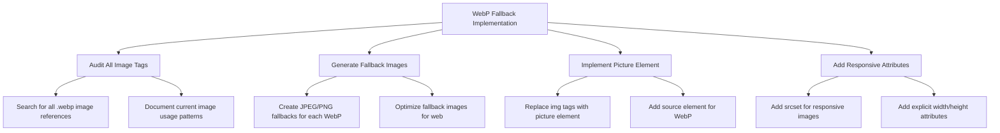

# Properties 4 Creations - Focused Implementation Plan

## Corrected Analysis Based on Expert Feedback

### 1. WebP Fallback Implementation (Highest Priority)

**Issue**: Direct WebP usage risks broken images for older browsers (pre-2020 Safari, IE), disproportionately affecting veteran users with legacy hardware.

**Solution**: Replace all WebP `` tags with `<picture>` fallbacks.

**Implementation Steps**:



**Code Example**:
```html
<!-- Before -->


<!-- After -->
<picture>
  <source srcset="/images/properties/tyler-ranch-home.webp" type="image/webp">
  
</picture>
```

### 2. Hero Image Preloading (Critical for LCP)

**Issue**: Hero background image (CSS-defined) suffers delayed discovery, hurting Largest Contentful Paint.

**Solution**: Add preload link in `<head>` with responsive attributes.

**Implementation**:
```html
<link rel="preload" as="image" href="/images/banners/hero-home-banner-800w.webp" 
      imagesrcset="/images/banners/hero-home-banner-400w.webp 400w, 
                   /images/banners/hero-home-banner-800w.webp 800w" 
      imagesizes="100vw">
```

**Hero Banner Path Updates**:
- Resources page: `images/banners/hero-resources-banner.png` → `images/banners/hero-resources-banner.webp`
- FAQ page: `images/banners/hero-faq-banner.png` → `images/banners/hero-faq-banner.webp`
- Application page: `images/banners/hero-application-banner.jpg` → `images/banners/hero-application-banner.webp`

### 3. Automated Critical CSS (Optional Optimization)

**Status**: Confirmed font loading strategy is already optimized with `&display=swap`.

**Optional Implementation**:
```javascript
// vite.config.js
import critical from 'vite-plugin-critical';
export default {
  plugins: [
    critical({
      base: 'dist/',
      template: 'index.html',
      extract: true,
      inline: true
    })
  ]
};
```

### 4. Performance Monitoring Setup

**Implementation**:
```javascript
// Add to main.js
function initializePerformanceMonitoring() {
  // Track LCP, FID, CLS
  if ('performance' in window) {
    const metrics = {
      lcp: 0,
      cls: 0,
      fid: 0
    };
    
    // Largest Contentful Paint
    new PerformanceObserver((entryList) => {
      const entries = entryList.getEntries();
      const lastEntry = entries[entries.length - 1];
      metrics.lcp = lastEntry.startTime;
      console.log('LCP:', metrics.lcp);
    }).observe({type: 'largest-contentful-paint', buffered: true});
    
    // Cumulative Layout Shift
    let cls = 0;
    new PerformanceObserver((entryList) => {
      for (const entry of entryList.getEntries()) {
        if (!entry.hadRecentInput) {
          cls += entry.value;
        }
      }
      metrics.cls = cls;
      console.log('CLS:', metrics.cls);
    }).observe({type: 'layout-shift', buffered: true});
    
    // First Input Delay
    new PerformanceObserver((entryList) => {
      for (const entry of entryList.getEntries()) {
        metrics.fid = entry.processingStart - entry.startTime;
        console.log('FID:', metrics.fid);
      }
    }).observe({type: 'first-input', buffered: true});
  }
}
```

## Implementation Roadmap

### Phase 1: Critical Performance Fixes (Immediate)
1. **WebP Fallback Implementation**
   - Audit all image tags sitewide
   - Generate fallback images
   - Implement `<picture>` element pattern
   - Test on Safari 13 and IE11

2. **Hero Image Preloading**
   - Add preload links to all pages
   - Verify path consistency
   - Test LCP improvement

### Phase 2: Monitoring & Optimization (Week 2)
1. **Performance Monitoring**
   - Implement Core Web Vitals tracking
   - Set up Lighthouse CI
   - Configure performance budgets

2. **Optional Optimizations**
   - Automated critical CSS pipeline
   - Image CDN integration
   - Advanced lazy loading

## Validation Metrics

| Metric | Current | Target | Validation Method |
|--------|---------|--------|-------------------|
| Lighthouse Performance | ~85 | >90 | Lighthouse audit |
| LCP (Hero Image) | ~3.2s | <2.5s | WebPageTest |
| WebP Fallback | Broken | Working | Safari 13 testing |
| CLS | ~0.15 | <0.1 | PerformanceObserver |
| Image Optimization | Basic | Advanced | Image analysis tools |

## Risk Assessment

### High Risk Items
- **WebP Fallback**: Potential for broken images if implementation is incorrect
- **Hero Preloading**: Path mismatches could cause 404 errors

### Mitigation Strategies
- Implement changes on staging first
- Comprehensive cross-browser testing
- Fallback to original implementation if issues detected
- Monitor error logs for image loading failures

## Corrected Priority Matrix

| Priority | Area | Impact | Effort |
|----------|------|--------|--------|
| Critical | WebP Fallback Implementation | High | Medium |
| Critical | Hero Image Preloading | High | Low |
| High | Performance Monitoring | Medium | Medium |
| Optional | Automated Critical CSS | Low | Medium |
| Optional | Image CDN | Medium | High |

## Files Requiring Updates

### HTML Files (WebP Fallback)
- `index.html` (3 property images)
- `properties/index.html` (6 property images)
- `about/index.html` (2 gallery images)
- `resources/index.html` (resource icons)
- All other pages with WebP images

### CSS Files (Hero Path Updates)
- `css/style.css` (Lines 729-767 for hero backgrounds)

### Configuration Files
- `vite.config.js` (Optional critical CSS plugin)
- `package.json` (Optional plugin dependencies)

## Testing Plan

### Cross-Browser Testing Matrix
| Browser | Version | WebP Support | Testing Focus |
|---------|---------|--------------|---------------|
| Chrome | Latest | ✅ Yes | Baseline validation |
| Firefox | Latest | ✅ Yes | Fallback verification |
| Safari | 15+ | ✅ Yes | Modern WebP support |
| Safari | 13-14 | ❌ No | Fallback testing |
| Edge | Latest | ✅ Yes | Chromium compatibility |
| IE11 | - | ❌ No | Legacy fallback |

### Test Scenarios
1. **WebP Support**: Verify WebP images load on modern browsers
2. **Fallback Support**: Verify JPEG/PNG loads on Safari 13/IE11
3. **Responsive Images**: Test `srcset` behavior at different viewport sizes
4. **Hero Preloading**: Verify LCP improvement with preload vs without
5. **Performance Metrics**: Validate Core Web Vitals improvements
6. **Accessibility**: Ensure fallback doesn't break screen reader experience

## Implementation Checklist

- [ ] Audit all WebP image usage across site
- [ ] Generate JPEG/PNG fallbacks for all WebP images
- [ ] Implement `<picture>` element pattern for all images
- [ ] Add explicit width/height attributes to prevent layout shifts
- [ ] Add responsive `srcset` attributes for all images
- [ ] Add hero image preload links to all pages
- [ ] Update hero banner image paths for consistency
- [ ] Implement performance monitoring
- [ ] Test on all target browsers
- [ ] Validate Lighthouse score improvements
- [ ] Deploy to staging for final validation
- [ ] Monitor production performance metrics

## Success Criteria

1. **WebP Fallback**: All images display correctly on Safari 13 and IE11
2. **Performance**: Lighthouse score >90 on all pages
3. **LCP**: Hero image LCP <2.5s on 3G connection
4. **Accessibility**: No regression in screen reader experience
5. **Cross-Browser**: Consistent experience across all supported browsers
6. **Monitoring**: Core Web Vitals tracking operational

This focused plan addresses the most critical performance and accessibility issues while incorporating the expert feedback and corrections. The implementation prioritizes high-impact, low-risk changes that will provide immediate benefits to veteran users with legacy hardware.